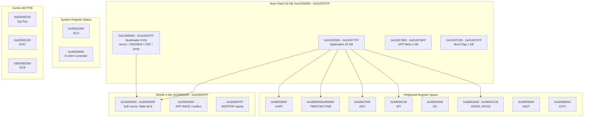

# TX32F01 Cortex-M0 内存与外设寄存器分配图

依据 `Device/TX32F01/Include/TX32F01.h`、当前 Bootloader/APP 工程 scatter 设计，以及 Cortex-M0 标准系统控制空间整理。

## 1. 总体地址空间

```text
0x00000000 ┌────────────────────────────────────────────┐
           │ Code alias / 启动向量映射区                 │
           │ 复位后向量表实际来自片内 Flash 起始区域      │
           └────────────────────────────────────────────┘

0x01000000 ┌────────────────────────────────────────────┐
           │ 片内 Main Flash：32 KB                      │
           │ 用户代码、Bootloader、APP、meta、boot flag   │
0x01007FFF └────────────────────────────────────────────┘

0x20000000 ┌────────────────────────────────────────────┐
           │ SRAM：4 KB                                  │
           │ 软向量表、全局变量、栈、heap/RTOS 栈          │
0x20000FFF └────────────────────────────────────────────┘

0x40001000 ┌────────────────────────────────────────────┐
           │ SCU：系统控制/时钟/复位/低功耗               │
           └────────────────────────────────────────────┘

0x40008000 ┌────────────────────────────────────────────┐
           │ FLASH 控制器寄存器                           │
           │ 擦写、保护、CRC、Die ID                       │
           └────────────────────────────────────────────┘

0x49000000 ┌────────────────────────────────────────────┐
           │ 外设寄存器区                                 │
           │ TIM/GPIO/UART/I2C/ADC/IWDT/EXTI/SPI          │
0x4900B000 └────────────────────────────────────────────┘

0xE000E000 ┌────────────────────────────────────────────┐
           │ Cortex-M0 PPB：系统外设区                    │
           │ SysTick / NVIC / SCB                         │
           └────────────────────────────────────────────┘
```

## 2. 当前工程 Flash 分区图

当前工程采用 Bootloader + APP 的布局。由于 Cortex-M0 没有 VTOR，Bootloader 保持在 Flash 起始位置接管向量表。

```text
片内 Flash：0x01000000 - 0x01007FFF，共 32 KB

0x01000000 ┌────────────────────────────────────────────┐
           │ Bootloader                                  │
           │ 大小：8 KB                                  │
           │ 内容：硬件向量表、YMODEM、Flash 写入、CRC、跳转 │
0x01001FFF └────────────────────────────────────────────┘

0x01002000 ┌────────────────────────────────────────────┐
           │ Application                                 │
           │ 大小：22 KB                                 │
           │ 内容：APP / APP_COOP / APP_LOG / APP_IRQ 等  │
0x010077FF └────────────────────────────────────────────┘

0x01007800 ┌────────────────────────────────────────────┐
           │ APP Meta Sector                              │
           │ 大小：1 KB                                   │
           │ 内容：magic、app_size、crc16                  │
0x01007BFF └────────────────────────────────────────────┘

0x01007C00 ┌────────────────────────────────────────────┐
           │ Boot Flag Sector                             │
           │ 大小：1 KB                                   │
           │ 内容：0xA55AF00D 表示强制留在 Bootloader      │
0x01007FFF └────────────────────────────────────────────┘
```

关键约束：

- Bootloader 链接基址：`0x01000000`
- APP 链接基址：`0x01002000`
- APP 最大可用 Flash：`0x5800`，即 22 KB
- meta 和 boot flag 必须独占 sector
- Bootloader 不应擦写 `0x01000000 - 0x01001FFF`

## 3. SRAM 分配图

```text
SRAM：0x20000000 - 0x20000FFF，共 4 KB

0x20000000 ┌────────────────────────────────────────────┐
           │ Bootloader / APP 共享软向量表                │
           │ 大小：96 B                                   │
           │ 用途：CM0 无 VTOR 时转发 APP 中断              │
0x2000005F └────────────────────────────────────────────┘

0x20000060 ┌────────────────────────────────────────────┐
           │ APP RW/ZI 区域                                │
           │ 全局变量、静态变量、调度器状态、日志缓冲等      │
           │ APP scatter file 应从这里开始放 RAM            │
           └────────────────────────────────────────────┘

           ┌────────────────────────────────────────────┐
           │ Heap / RTOS task stacks / 临时 buffer         │
           │ 4 KB SRAM 很紧，建议尽量静态分配并审查 map      │
           └────────────────────────────────────────────┘

0x20000FFF ┌────────────────────────────────────────────┐
           │ MSP 主栈顶部                                  │
           │ 裸机/协作式调度：主栈和 ISR 共用 MSP           │
           │ FreeRTOS：中断用 MSP，任务通常用 PSP           │
           └────────────────────────────────────────────┘
```

软向量表说明：

- 地址：`0x20000000`
- 大小：96 B
- 原因：Cortex-M0 没有 VTOR，APP 中断必须通过 Bootloader trampoline 间接转发
- 风险：APP 的 RAM 起始地址如果仍从 `0x20000000` 开始，会覆盖软向量表

## 4. 外设基地址总表

| 模块 | 基地址 | 主要用途 | IRQ |
|---|---:|---|---:|
| `SCU` | `0x40001000` | 时钟、外设使能、复位、低功耗、启动映射 | - |
| `FLASH` 控制器 | `0x40008000` | Flash 擦写、CRC、保护、Die ID | `FLASH_IRQn = 2` |
| `TIM0` | `0x49000000` | 16-bit Timer/PWM/Capture/Break | `TIM0_IRQn = 12` |
| `TIM1` | `0x49000400` | 16-bit Timer/PWM/Capture/Break | `TIM1_IRQn = 13` |
| `TIM2` | `0x49000800` | 16-bit Timer/PWM/Capture/Break | `TIM2_IRQn = 14` |
| `SPI` | `0x49000C00` | SPI 主/从、FIFO、分频 | `SPI_IRQn = 17` |
| `GPIO0` | `0x49001000` | GPIO port 0 | EXTI/GPIO 复用 |
| `GPIO1` | `0x49001400` | GPIO port 1 | EXTI/GPIO 复用 |
| `GPIO2` | `0x49001800` | GPIO port 2 | EXTI/GPIO 复用 |
| `GPIO3` | `0x49001C00` | GPIO port 3，当前 UART 常用 | EXTI/GPIO 复用 |
| `UART` | `0x49002000` | UART TX/RX，调试与 YMODEM | `UART_IRQn = 15` |
| `I2C` | `0x49005000` | I2C master/slave | `I2C_IRQn = 16` |
| `ADC` | `0x49007000` | ADC 序列转换、内部参考 | `ADC_IRQn = 11` |
| `IWDT` | `0x49009000` | 独立看门狗 | `IWDT_IRQn = 0` |
| `EXTI` | `0x4900B000` | 外部中断线配置 | `EXTI0_IRQn = 4` 至 `EXTI7_IRQn = 10` |

## 5. SCU 寄存器图

基地址：`SCU_BASE = 0x40001000`

| 偏移 | 绝对地址 | 寄存器 | 用途 |
|---:|---:|---|---|
| `0x00` | `0x40001000` | `PKR` | SCU 寄存器访问解锁 key |
| `0x04` | `0x40001004` | `CCR` | HCLK 分频、MCO 输出选择 |
| `0x08` | `0x40001008` | `PENR` | 外设时钟使能 |
| `0x0C` | `0x4000100C` | `PRSTR` | 外设复位 |
| `0x10` | `0x40001010` | `RSR` | 复位原因标志 |
| `0x14` | `0x40001014` | `PMCR` | BOR/PVD 电源监控 |
| `0x18` | `0x40001018` | `LPCR` | 低功耗配置 |
| `0x1C` | `0x4000101C` | `DBGCR` | debug sleep/stop、调试暂停 Timer/IWDT |
| `0x20` | `0x40001020` | `STR` | SysTick 校准值 |
| `0x24` | `0x40001024` | `BSR` | Boot 映射选择 |

常用位：

- `PENR.TIM0EN/TIM1EN/TIM2EN`
- `PENR.UARTEN/I2CEN/ADCEN/SPIEN`
- `PENR.GPIO0EN/GPIO1EN/GPIO2EN/GPIO3EN`
- `PRSTR.TIM0RST/TIM1RST/TIM2RST`
- `PRSTR.UARTRST/I2CRST/ADCRST/SPIRST`
- `RSR.PORRSTF/BORRSTF/PINRSTF/IWDTRSTF/SFTRSTF`
- `LPCR.HRCON/IWDTON/LDOON/FLSDPSTB`
- `DBGCR.DEBUG_IWDT_STOP/DEBUG_TIM0_STOP/DEBUG_TIM1_STOP/DEBUG_TIM2_STOP`
- `BSR.BOOT`

## 6. FLASH 控制器寄存器图

基地址：`FLASH_BASE = 0x40008000`

| 偏移 | 绝对地址 | 寄存器 | 用途 |
|---:|---:|---|---|
| `0x00` | `0x40008000` | `ASR` | Flash 访问状态 |
| `0x04` | `0x40008004` | `ACR` | Flash 访问控制、wait cycle |
| `0x08` | `0x40008008` | `ACHKR` | 擦写校验使能 |
| `0x0C` | `0x4000800C` | `PEKEYR` | 擦写 key |
| `0x20` | `0x40008020` | `IFR` | Flash 中断/状态标志 |
| `0x24` | `0x40008024` | `IER` | Flash 中断使能 |
| `0x30` | `0x40008030` | `TKEYR` | Flash timing 配置 key |
| `0x34` | `0x40008034` | `TNVS` | Flash timing 参数 |
| `0x38` | `0x40008038` | `TPROG` | Program timing |
| `0x3C` | `0x4000803C` | `TADS` | Address setup timing |
| `0x40` | `0x40008040` | `TADH` | Address hold timing |
| `0x44` | `0x40008044` | `TPGS` | Program setup timing |
| `0x48` | `0x40008048` | `TPGH` | Program hold timing |
| `0x4C` | `0x4000804C` | `TPRCV` | Program recovery timing |
| `0x50` | `0x40008050` | `TSRCV` | Sector erase recovery timing |
| `0x54` | `0x40008054` | `TCRCV` | Chip erase recovery timing |
| `0x58` | `0x40008058` | `TSERASE` | Sector erase timing |
| `0x5C` | `0x4000805C` | `TCERASE` | Chip erase timing |
| `0x60` | `0x40008060` | `TRW` | Read/write timing |
| `0xE0` | `0x400080E0` | `DIEID0` | Die ID 0 |
| `0xE4` | `0x400080E4` | `DIEID1` | Die ID 1 |
| `0xE8` | `0x400080E8` | `DIEID2` | Die ID 2 |
| `0xEC` | `0x400080EC` | `DIEID3` | Die ID 3 |
| `0xF0` | `0x400080F0` | `CRCCR` | Flash CRC 控制 |
| `0xF4` | `0x400080F4` | `CRCARL` | CRC 起始/低地址 |
| `0xF8` | `0x400080F8` | `CRCARH` | CRC 结束/高地址 |
| `0xFC` | `0x400080FC` | `CRCVR` | CRC 结果 |
| `0x100` | `0x40008100` | `PKEYR` | Flash 控制寄存器访问保护 key |
| `0x104` | `0x40008104` | `PRGKEYR` | Main Flash program enable key |
| `0x10C` | `0x4000810C` | `NVR_WR_EN` | NVR 写使能 |
| `0x234` | `0x40008234` | `MANU_PRGKEYR` | Manu NVR program protect key |
| `0x238` | `0x40008238` | `FLASH_FNKEYR` | Flash function key |

Flash OTA 关键寄存器：

- `ACR.WAIT_PRD`
- `ACHKR.ECHK_EN/PCHK_EN`
- `PEKEYR`
- `IFR.SED/PD/EIA/PIA/EE/PE/CRCD/CRCE`
- `CRCCR.START`
- `CRCARL/CRCARH/CRCVR`
- `PKEYR/PRGKEYR`

## 7. Timer 寄存器图

适用于：`TIM0 = 0x49000000`、`TIM1 = 0x49000400`、`TIM2 = 0x49000800`

| 偏移 | 寄存器 | 用途 |
|---:|---|---|
| `0x00` | `CR` | 计数器使能、运行模式、预装载 |
| `0x04` | `CCCR` | Capture/Compare 控制、输出极性 |
| `0x08` | `BCR` | Break 控制 |
| `0x0C` | `TCR` | Trigger 控制 |
| `0x10` | `IER` | 中断使能 |
| `0x14` | `IFR` | 中断标志 |
| `0x18` | `CNT` | 当前计数值 |
| `0x1C` | `DIV` | 分频 |
| `0x20` | `ARR` | 自动重装载值 |
| `0x24` | `CCR` | Compare/Capture 值 |
| `0x28` | `DTG` | 死区时间 |

常用位：

- `CR.CEN`
- `CR.MODE`
- `CR.ARPE/CCPE`
- `CCCR.OCXE/OCXNE/OCXP/OCXNP`
- `BCR.BRKEN/BRKCLR`
- `IER.CNTIE/CCIE/BIE/TIE`
- `IFR.CNTIF/CCIF/BIF/TIF`

## 8. GPIO 寄存器图

适用于：`GPIO0 = 0x49001000`、`GPIO1 = 0x49001400`、`GPIO2 = 0x49001800`、`GPIO3 = 0x49001C00`

| 偏移 | 寄存器 | 用途 |
|---:|---|---|
| `0x00` | `MDR` | 输入/输出/复用等模式 |
| `0x04` | `PUR` | 上拉 |
| `0x08` | `PDR` | 下拉 |
| `0x0C` | `DSR` | 驱动强度 |
| `0x10` | `SRR` | Slew rate |
| `0x14` | `OTR` | 推挽/开漏 |
| `0x18` | `IER` | 输入使能 |
| `0x20` | `AFR` | 复用功能选择 |
| `0x28` | `ODR` | 输出数据 |
| `0x2C` | `BSR` | 置位输出 |
| `0x30` | `BRR` | 清零输出 |
| `0x34` | `BFR` | 翻转输出 |
| `0x38` | `IDR` | 输入数据 |

当前工程常用引脚：

- LED：`GPIO0.PIN03`
- UART RX：`GPIO3.PIN06`
- UART TX：`GPIO3.PIN07`
- SoftCAN TX：`GPIO1.PIN00`
- SoftCAN RX：`GPIO1.PIN01`
- SPI NOR CS：`GPIO2.PIN04`
- SPI NOR CLK：`GPIO2.PIN05`
- SPI NOR MOSI：`GPIO3.PIN00`
- SPI NOR MISO：`GPIO3.PIN01`

## 9. UART 寄存器图

基地址：`UART_BASE = 0x49002000`

| 偏移 | 绝对地址 | 寄存器 | 用途 |
|---:|---:|---|---|
| `0x00` | `0x49002000` | `CR` | 校验、字长、停止位、极性 |
| `0x04` | `0x49002004` | `BRR` | 波特率分频 |
| `0x08` | `0x49002008` | `IER` | 中断使能 |
| `0x0C` | `0x4900200C` | `ISR` | 状态/中断标志 |
| `0x10` | `0x49002010` | `TDR` | 发送数据 |
| `0x14` | `0x49002014` | `RDR` | 接收数据 |
| `0x20` | `0x49002020` | `CER` | UART/TX/RX 使能 |
| `0x100` | `0x49002100` | `SADJ` | stop bit 宽度微调 |

常用位：

- `CR.PS/PCE/M/STOP/TXP/RXP`
- `BRR.FAC/MNTI`
- `IER.TCIE/TDEIE/RDNEIE/RDOVIE/FEIE`
- `ISR.TC/TDE/RDNE/RDOV/FE`
- `CER.UE/RE/TE`

## 10. SPI 寄存器图

基地址：`SPI_BASE = 0x49000C00`

| 偏移 | 绝对地址 | 寄存器 | 用途 |
|---:|---:|---|---|
| `0x00` | `0x49000C00` | `CR` | SPI 使能、主从、CPOL/CPHA、NSS、FIFO 清除 |
| `0x04` | `0x49000C04` | `SR` | 传输状态、FIFO 状态、错误标志 |
| `0x08` | `0x49000C08` | `IER` | SPI 中断使能 |
| `0x0C` | `0x49000C0C` | `DIVR` | SPI 分频 |
| `0x10` | `0x49000C10` | `DATAR` | SPI 数据 |
| `0x14` | `0x49000C14` | `TCNTR` | TX FIFO 计数 |
| `0x18` | `0x49000C18` | `RCNTR` | RX FIFO 计数 |

常用位：

- `CR.SPEN/MSTR/CPHA/CPOL/NSEL/NSS/RFCL/TFCL`
- `SR.SPIF/MODF/OVFL/UDRU/TXEM/RXFU/RXEM/TXFU/SRMT/BUSY`
- `DIVR.DIV`
- `DATAR.DATA`

## 11. I2C 寄存器图

基地址：`I2C_BASE = 0x49005000`

| 偏移 | 绝对地址 | 寄存器 | 用途 |
|---:|---:|---|---|
| `0x00` | `0x49005000` | `DR` | I2C 收发数据 |
| `0x04` | `0x49005004` | `AR` | 从机地址、地址 mask、General Call |
| `0x08` | `0x49005008` | `CR` | START/STOP/ACK/使能/控制码 |
| `0x0C` | `0x4900500C` | `SR` | I2C 状态码 |

常用位：

- `DR.DATA`
- `AR.GC/ADDR/MASK`
- `CR.AA/SI/STO/STA/EN/CR`
- `SR.STA`

## 12. ADC 寄存器图

基地址：`ADC_BASE = 0x49007000`

| 偏移 | 绝对地址 | 寄存器 | 用途 |
|---:|---:|---|---|
| `0x00` | `0x49007000` | `IFR` | ADC 中断标志 |
| `0x04` | `0x49007004` | `IER` | ADC 中断使能 |
| `0x08` | `0x49007008` | `CR` | ADC 启动/使能 |
| `0x0C` | `0x4900700C` | `CFGR` | ADC clock、trigger、VREF 配置 |
| `0x10` | `0x49007010` | `SQR1` | 序列控制 1 |
| `0x14` | `0x49007014` | `SQR2` | 序列控制 2 |
| `0x20` | `0x49007020` | `DR1` | 序列 1 转换结果 |
| `0x24` | `0x49007024` | `DR2` | 序列 2 转换结果 |
| `0x28` | `0x49007028` | `DR3` | 序列 3 转换结果 |
| `0x2C` | `0x4900702C` | `DR4` | 序列 4 转换结果 |
| `0x30` | `0x49007030` | `DR5` | 序列 5 转换结果 |
| `0x34` | `0x49007034` | `DR6` | 序列 6 转换结果 |
| `0x38` | `0x49007038` | `DR7` | 序列 7 转换结果 |
| `0x3C` | `0x4900703C` | `DR8` | 序列 8 转换结果 |
| `0x40` | `0x49007040` | `OFR` | ADC offset |
| `0x44` | `0x49007044` | `VREFRL` | 2.048 V 内部参考实测值 |
| `0x48` | `0x49007048` | `VREFRH` | 4.048/4.096 V 内部参考实测值 |

常用位：

- `CR.START/EN`
- `CFGR.CLKDIV/TRGSEL/VREF_SEL/VREF_BYP`
- `SQR1.SQLEN`
- `SQR2.SQ3/SQ4/SQ5/SQ6`
- `DRx.DATA`
- `VREFRL.VREFL`
- `VREFRH.VREFH`

## 13. IWDT 寄存器图

基地址：`IWDT_BASE = 0x49009000`

| 偏移 | 绝对地址 | 寄存器 | 用途 |
|---:|---:|---|---|
| `0x00` | `0x49009000` | `KR` | 看门狗 key |
| `0x04` | `0x49009004` | `PR` | 预分频 |
| `0x08` | `0x49009008` | `RLR` | 重装载值 |
| `0x0C` | `0x4900900C` | `SR` | 状态 |
| `0x10` | `0x49009010` | `IER` | 中断使能 |
| `0x14` | `0x49009014` | `IFR` | 中断标志 |

常用位：

- `KR.KR`
- `PR.PR`
- `RLR.RLR`
- `IER/IFR`
- 与低功耗相关：`SCU->LPCR.IWDTON`
- 与调试暂停相关：`SCU->DBGCR.DEBUG_IWDT_STOP`

## 14. EXTI 寄存器图

基地址：`EXTI_BASE = 0x4900B000`

| 偏移 | 绝对地址 | 寄存器 | 用途 |
|---:|---:|---|---|
| `0x00` | `0x4900B000` | `IMR` | 中断 mask |
| `0x04` | `0x4900B004` | `EMR` | 事件 mask |
| `0x08` | `0x4900B008` | `RTSR` | 上升沿触发选择 |
| `0x0C` | `0x4900B00C` | `FTSR` | 下降沿触发选择 |
| `0x10` | `0x4900B010` | `SWIER` | 软件触发 |
| `0x14` | `0x4900B014` | `PR` | pending 标志 |
| `0x18` | `0x4900B018` | `CFGR` | EXTI line 到 GPIO port 映射 |

常用位：

- `IMR.IM0` 至 `IMR.IM7`
- `RTSR.TR0` 至 `RTSR.TR7`
- `FTSR.TR0` 至 `FTSR.TR7`
- `PR.PR0` 至 `PR.PR7`
- `CFGR.EXTI0` 至 `CFGR.EXTI7`

## 15. Cortex-M0 系统外设区

这些不是 TX32F01 私有外设，而是 ARM Cortex-M0 标准 PPB 区域。

| 模块 | 地址范围 | 用途 |
|---|---:|---|
| SysTick | `0xE000E010` 起 | `CTRL`、`LOAD`、`VAL`、`CALIB` |
| NVIC | `0xE000E100` 起 | IRQ enable/disable/pending/priority |
| SCB | `0xE000ED00` 起 | CPUID、ICSR、AIRCR、SCR、CCR、SHPR、SHCSR |

当前工程关键点：

- SysTick 用于调度 tick 和中断延迟测量
- NVIC 用于启用 UART/TIM/EXTI/ADC/SPI/I2C 等中断
- `SCB->AIRCR` 可触发软件复位
- Cortex-M0 没有 VTOR，所以没有 `SCB->VTOR` 可用

## 16. Mermaid 概览图

如果 Markdown 查看器支持 Mermaid，可以用下面图形快速查看地址分配。



## 17. SWD 引脚（绝对禁止挪用）

```
GPIO0.PIN00 = SWDIO
GPIO0.PIN01 = SWCLK
```

这两个引脚是芯片的 SWD 调试接口。**任何模式（output / AF / analog / input）配置它们都会立刻让 J-Link 失联**——固件继续跑（LED 仍闪），但 debug 进不去、Keil 再也找不到芯片。

**判定证据**：vendor 的 `TX32F01_DemoBoard_Lib/` 下**所有** demo 都刻意避开了这两个引脚：

```bash
grep -r "GPIO0.*PIN0[01]" TX32F01_DemoBoard_Lib/   # 返回 0 行
```

而 GPIO2.PIN00/01/02、GPIO3.PIN05 这些都被多个 demo 用过，且仍能 debug。

**事故记录**：早期 `APP_FOC/FOC/foc_config.h` 把 Phase V 配在了 GPIO0.PIN00/01（T1CH/T1CHN）上 → chip 跑得好好的 → 但 J-Link 永久失联 → 只能 `connect under reset` + 重新烧 vendor demo 救回。

**`foc_pwm.c::cfg_pins()` 现已在编译期 + 启动期硬断言**所有 Phase 引脚都不是 SWD 引脚——见 `IS_SWD_PIN()`。

**救回方法**：
1. Keil → Debug → JLink Settings → `Connect = under Reset`
2. 物理按 RST 启 debug
3. `JLink.exe → erase` 抹片子重烧

## 18. 专家使用建议

- 写外设驱动时，第一步先开 `SCU->PENR` 对应外设时钟。
- 复位外设时使用 `SCU->PRSTR`，然后重新配置寄存器。
- 任何 APP 中断都必须考虑无 VTOR 软向量转发。
- Flash 控制寄存器区 `0x40008000` 是控制器，不是代码存储地址；真正代码 Flash 在 `0x01000000`。
- 4 KB SRAM 极小，必须定期检查 `.map`，尤其是 FreeRTOS task stack、printf buffer、日志 page buffer。
- `GPIOx->BSR/BRR/BFR` 比读改写 `ODR` 更适合 ISR 或并发场景。
- 低功耗、IWDT、debug halt 的行为要一起验证，不能只看单个模块 demo。
- **任何 GPIO 引脚分配都先验证不是 SWD 引脚**（见 §17）。
